# 7B Selenium IDE – Selenium IDE 和 Firebug 安装

> 原文： [https://javabeginnerstutorial.com/selenium/7b-selenium-ide-firebug-installation/](https://javabeginnerstutorial.com/selenium/7b-selenium-ide-firebug-installation/)

欢迎来到我们的第一篇*探索*（就像唱歌一样！）帖子。 为了从我们的 Selenium 系列中获得最大收益，建议您密切注意并共同努力。 它是如此简单！

*魔术草地*的土地上，在我们看到真正的魔术发生之前，是时候为其设置环境了。 听起来有点技术性，不是吗？ 但不用担心，这很容易，因为 Selenium IDE 是作为 Firefox 插件提供的。

因此，开始进行安装过程所需要的就是有效的互联网连接。

（那些已经在您的系统上安装 Mozilla Firefox 浏览器的人，应该坐下来放松一下，直到完成第 1 步。向下滚动一点，从最期待的第 2 步开始进行操作）

## 步骤 1：安装 Firefox

从 [https://www.mozilla.org/zh-cn/firefox/new/](https://www.mozilla.org/en-US/firefox/new/) 下载最新版本的 Firefox

[

下载设置文件后，它看起来像这样。

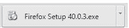

因此，继续并单击 exe 文件。 提取达到 100% 后，将弹出 Mozilla Firefox 安装向导。 点击“下一步”按钮。

您可以很好地使用标准作为设置类型。 完全留给您方便。 我选择“标准”，然后单击“下一步”。

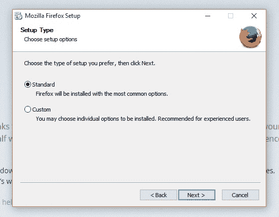

显示了将安装 Firefox 的位置的摘要。 只需单击“安装”按钮。

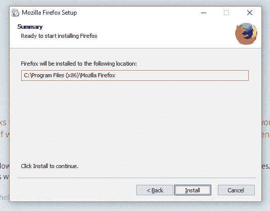

将进行安装，

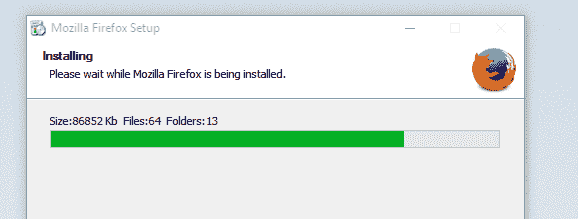

单击“完成”，然后启动 Firefox 浏览器以开始使用。

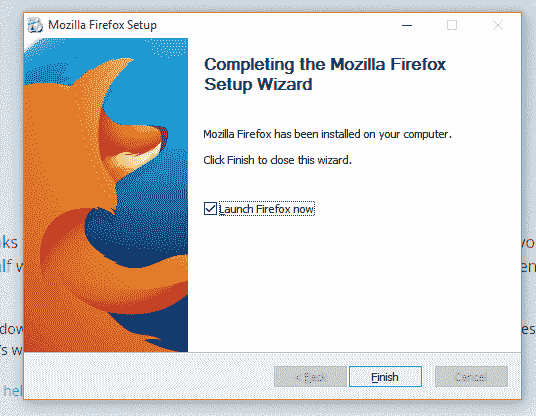

## 步骤 2：安装 Selenium IDE

启动 Firefox 浏览器后，转到 [https://www.seleniumhq.org/download/](https://www.seleniumhq.org/download/) 。 向下滚动，直到到达 **Selenium IDE** 部分。 单击最新版本号，如下所示。 （请注意，您看到的版本号可能与此处快照中的版本号不同，因为 2.9.0 是创建此帖子时的最新版本。）

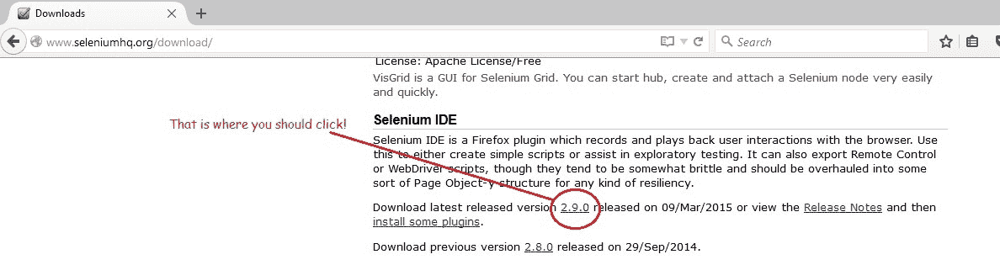

由于安全性设置，单击版本号后，可能会弹出一个窗口。 单击“允许”按钮继续安装。

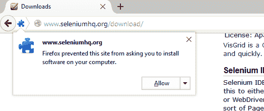

如图所示进行下载，

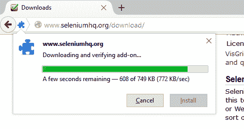

下载完成后，单击“安装”按钮。

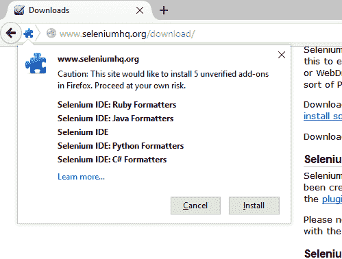

安装完成后，单击“立即重新启动”。

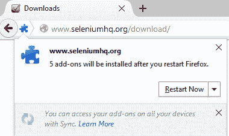

Firefox 重新启动后，我们可以通过以下其中一种方式启动 **Selenium IDE**，

*   使用`Alt + Ctrl + S`的组合。
*   单击工具栏中的 Se 图标（如果已可用）。

*   您始终可以使用从 Firefox 菜单启动它的常规方法。 如果您没有看到菜单，请按 Alt 键，它将弹出。 单击“**工具 -> Selenium IDE**”或“**工具 -> Web 开发者 -> Selenium IDE**”。

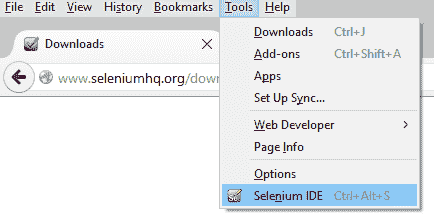

现在，让我展示一下 Selenium IDE 在启动时的外观。

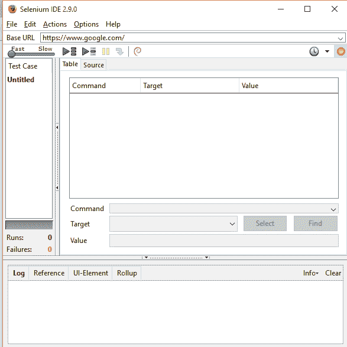

## 步骤 3：安装 Firebug

关于 **Firebug** 的几句话：它是 Mozilla Firefox 的免费开放源代码 Web 浏览器扩展。 我们将利用其优势，在使用 Selenium 进行自动化的情况下，识别和检查应用的 Web 元素。 如果您不了解我在说什么，那完全没问题。 只需立即安装 Firebug。 随着我们更深入地探索，一切都会落在原地。

*该采取行动了*：启动 Firefox 并导航至 [https://getfirebug.com/downloads/](https://getfirebug.com/downloads/) 用于下载 Firebug。

根据与当前 Firefox 版本的兼容性，单击“**下载**”链接。

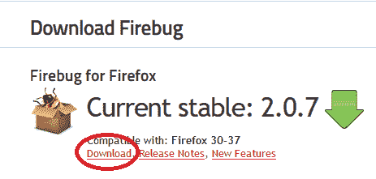

单击下载链接将带您到 Firefox 加载项页面。 只需在 Firebug 部分中单击“**添加到 Firefox**”。

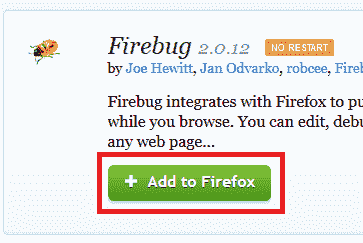

Firefox 将下载该加载项。 完成后，将出现一个对话框以安装 Firebug。 点击“**安装**”按钮。

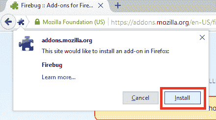

完成安装后，将看到一条通知，指出“Firebug 已成功安装”。 即使没有出现，也没有什么可担心的。

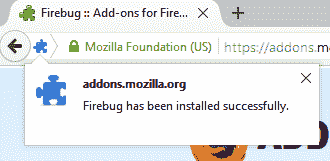

而且，安装 Firebug 后无需重新启动浏览器。

您一定想知道如何启动此加载项。 这很简单，有两种方法可以实现，

*   按下功能键`F12`
*   单击 **Firebug 图标**，该图标将在 Firefox 工具栏的右上角提供。

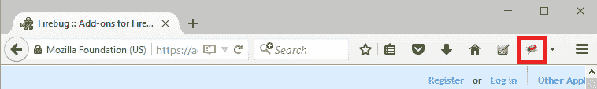

Firebug 通常会在 Firefox 窗口底部启动，这就是它的外观，

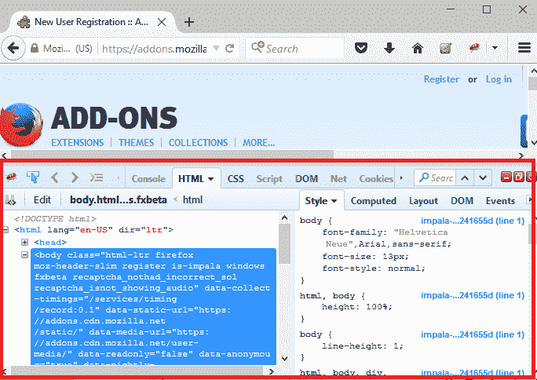

今天就这些了。 您已经准备好进行一些视觉处理，但这需要稍等片刻。

在另一篇文章中再见，我们将在 Selenium IDE 中探索更多有关选项的信息。 祝你今天愉快！

