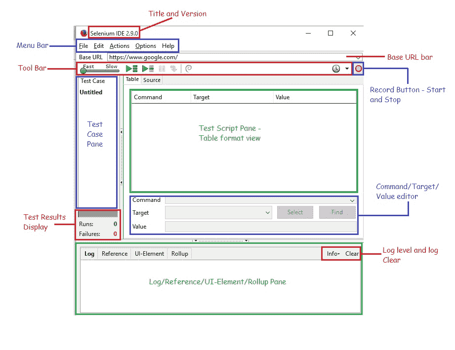

# 7C Selenium IDE – 突破表面：初探

> 原文： [https://javabeginnerstutorial.com/selenium/7c-selenium-ide-first-look/](https://javabeginnerstutorial.com/selenium/7c-selenium-ide-first-look/)

朋友！ 今天我们要看看是什么使**魔术草地**如此神奇地生活在其中。不，说真的，这真是太棒了！ 不相信我吗？ 继续阅读...

我知道您有兴趣了解此 Selenium IDE 究竟将为您提供什么功能，以便您能够轻松地自动化测试中的应用。

因此，这里是对 Selenium IDE 的初步了解：

这应该使您对其中的所有内容都有基本的了解。 简短，甜美，而且更简单！

无论如何，我们将更深入地研究这些功能，但稍后我将对其进行保存。 请继续关注此空间，以确保您不会错过任何即将发布的帖子！

祝你有美好的一天！

