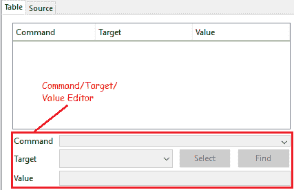
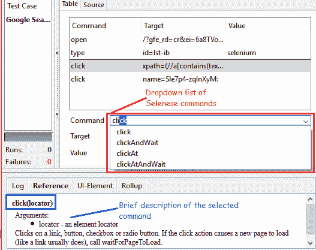

# 7F Selenium IDE – 命令，目标和值

> 原文： [https://javabeginnerstutorial.com/selenium/7f-ide-command-target-value/](https://javabeginnerstutorial.com/selenium/7f-ide-command-target-value/)

朋友！ 知道我们可以对自己做的事情有更多的控制权，这真令人兴奋吗？ 是。 在魔法草地的土地上，Selenium IDE 不仅提供录制功能，还使我们能够插入和编辑命令。 使得这一切成为现实的是“命令/目标/值编辑器”。

我们可以创建和编辑 Selenese 命令。

**命令**：

*   命令是我们希望执行的动作。
*   *这里有*几个示例， *点击并等待*和*关闭*。
*   当我们开始在“命令”部分中键入内容时，将显示一个匹配的命令下拉列表。
*   此外，另一个优点是，“参考”部分显示了所选命令的简要说明以及所需的参数。

哦！ 记住整个命令列表以及它们的语法，必需的参数及其描述并不是真的需要惊动我们的大脑。 生活变得更轻松！）

**目标**：

顾名思义，这是我们要执行操作的网络元素，即看到一些魔术正在发生。 名称，ID，XPath 等可用于唯一标识所需的 Web 元素。

**值**：

我们希望为选定目标提供的数据或输入称为值。

例如，如果我们选择在 Selenium 上执行 Google 搜索，

命令将是“类型”

目标将是可以识别的搜索框，其“ID”和值将为“Selenium”

我们刚才讨论的内容不清楚吗？ 绝对不用担心！ 因为当我们记录并运行我们的第一个 Selenium IDE 测试脚本时，将获得清晰的画面。 最好的是，这就是我们下一篇文章的全部内容！

因此，如果您不想错过任何一条信息，请点击“关注”按钮！

探索愉快！ 祝你有美好的一天。

