# 7G Selenium IDE – 记录和运行测试用例

> 原文： [https://javabeginnerstutorial.com/selenium/7g-ide-recording-test-case/](https://javabeginnerstutorial.com/selenium/7g-ide-recording-test-case/)

嗨呀测试人员！ 欢迎来到魔术草甸地区的另一篇*探索*文章。 密切关注并共同努力，在回放录音时看到一些真正的魔术。

我们将通过*录制*并在*回放*功能的帮助下执行，在 Selenium IDE 中创建我们的第一个测试脚本。

**场景**：

*   打开 Gmail 登录页面
*   输入任何无效的用户名和密码
*   提交登录详细信息
*   确认由于提交无效凭据而显示的错误消息
*   声明页面标题
*   插入新命令以等待特定值
*   验证来自 Selenium IDE 工具的日志
*   将测试用例保存在所需的位置

*步骤 1：*

*   启动 Firefox 浏览器和 Selenium IDE 工具
*   默认情况下，录制按钮将处于 ON 状态
*   在基本 URL 文本栏中输入 URL 值“https://accounts.google.com/”

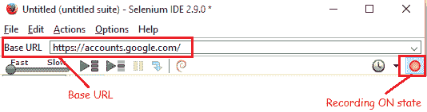

*步骤 2：*

*   在 Firefox 浏览器中导航到“https://accounts.google.com/”
*   确保录制按钮处于 ON 状态，否则切换以将其打开
*   输入任何无效的用户名，然后单击“下一步”
*   输入任何无效的密码。 此时，Selenium IDE 编辑器部分将如下所示：

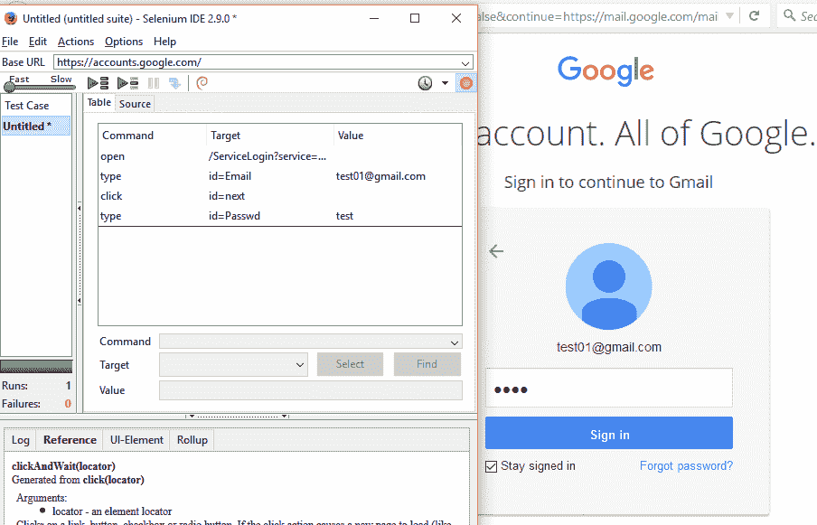

*步骤 3：*

*   点击“登录”按钮
*   将显示错误信息
*   要验证消息，请选择它并右键单击
*   这将打开 Selenium IDE 上下文菜单
*   要查看所有命令，请单击“显示可用命令”
*   选择“`assertText id = errormsg_0_Passwd`您输入的电子邮件和密码不匹配。” 

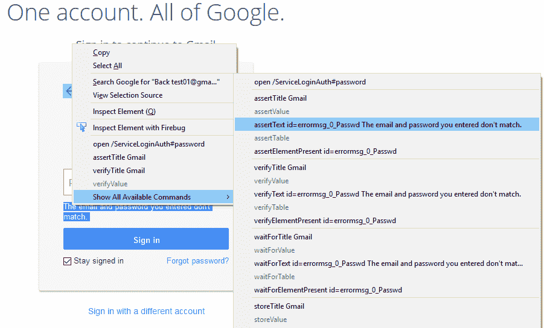

*步骤 4：*

*   右键单击页面上除超链接和图像以外的任何位置
*   选择“断言标题 Gmail”以验证页面标题

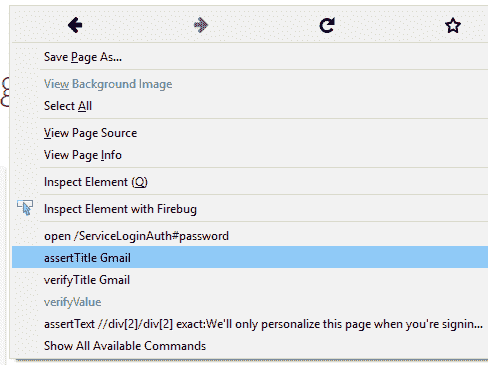

*   切换记录按钮以将其更改为关闭状态
*   完成的脚本如下图所示

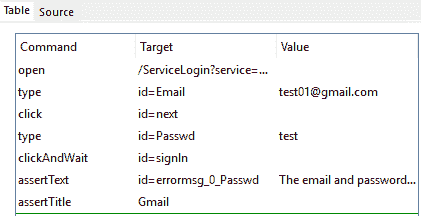

*步骤 5：*

*   让我们在输入密码之前插入一个新命令
*   在 Selenium IDE 中，在命令“类型”（目标为“`id = Passwd`”）上，右键单击并选择“插入新命令”

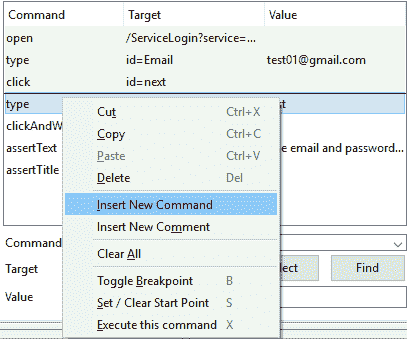    

*   在“命令，目标，值”部分，为命令输入“`waitForValue`”，为目标输入“`id = Passwd`”

*步骤 6：*

*   要进行播放，请点击“播放当前测试用例”图标，如下所示，

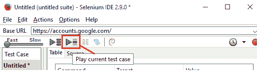

*   检查方案是否被完美复制
*   成功执行后，每个步骤将以绿色编码
*   可以查看日志并根据需要选择日志记录级别

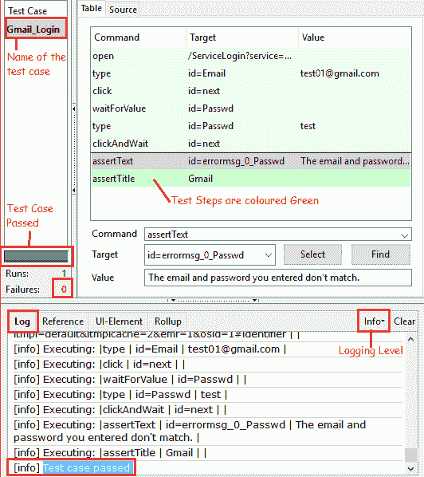

*   万一测试用例失败，错误将显示在以红色编码的日志中

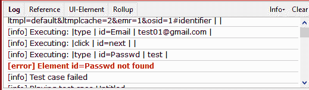

*步骤 7：*

*   对结果满意后，我们想保存此测试用例，以备将来之用，例如回归测试
*   点击文件菜单，然后选择“保存测试用例”

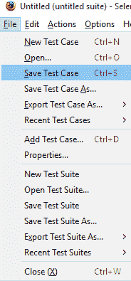

*   在弹出的窗口中输入文件名，然后点击“保存”

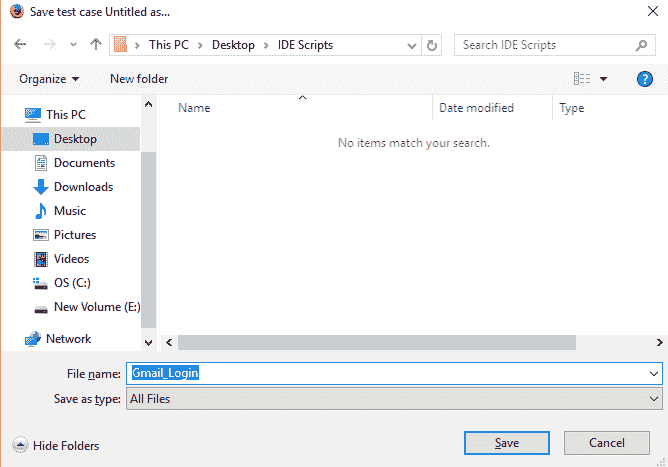

*   默认情况下，保存的文件将采用 HTML 格式

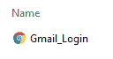

现在轮到您尝试新的情况了。 录制完成后，请放松，放松并观看 Selenium IDE 为您进行测试。

祝你有美好的一天！

