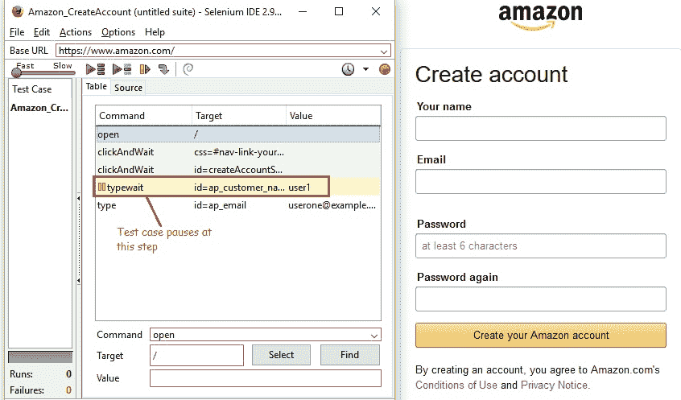
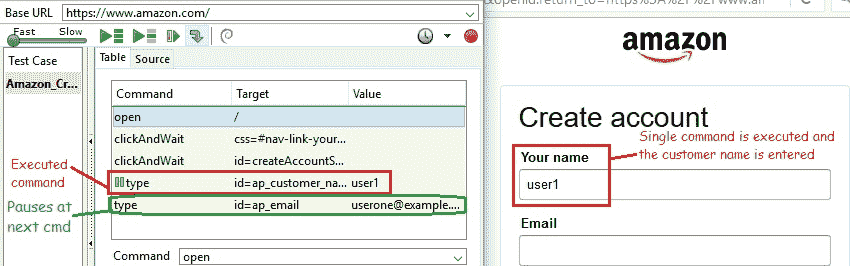
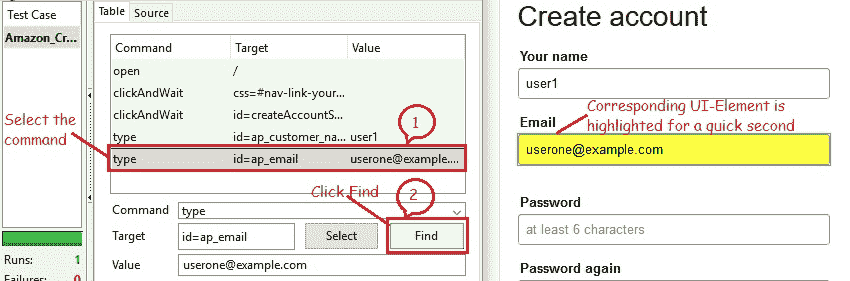
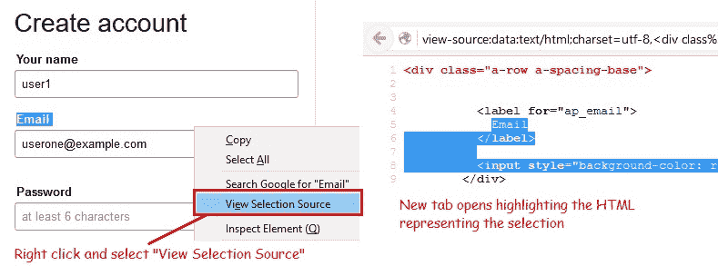

# 7J Selenium IDE – 调试

> 原文： [https://javabeginnerstutorial.com/selenium/7j-ide-debugging/](https://javabeginnerstutorial.com/selenium/7j-ide-debugging/)

嗨呀测试人员！ 欢迎回到我们针对 Selenium 初学者的全职领导者的另一篇探索文章，即“Selenium IDE” ！！ 现在是时候密切注意进行调试了。

我们的目标雄心勃勃，但我们将一次迈出一步。

首先，什么是调试？ 它正在识别并修复测试用例中可能存在的任何错误。 就如此容易！ 而且最重要的是调试和测试我们的代码，以确保其以预期的方式工作。

让我们把脚弄湿！ 提出了不同的方式来帮助我们调试错误的测试脚本，并在我们提供的产品上保持一流！

**断点和起点**

（有关详细说明，请参阅我以前的博客“[7i。Selenium IDE – 设置超时，断点，起点](https://javabeginnerstutorial.com/selenium/7i-ide-timeouts-breakpoints-startpoints/)”）

*   **断点**使我们能够运行测试用例中的特定命令，并在该点停止检查行为。
*   确保在要检查的命令之前在命令上设置一个断点。
*   我们可以在一个测试用例中设置多个断点。
*   **起点**在我们必须从中间到最后运行测试用例时很有用。
*   例如，假设第一步是登录，然后在网站上执行一系列测试，而您尝试调试其中一个。 为此，您只需登录一次，在测试用例的登录部分之后设置一个起点，然后根据需要重新运行多次。
*   每个测试用例只能有一个起点。

**逐步通过测试用例**

是! **单步**按钮用于通过一次执行一个命令来逐步遍历我们的测试用例。 仔细查看日志窗格，您会发现为每个执行的命令附加了一行日志。 而且，您可能需要在运行测试用例之前清除日志窗格，因为 Selenium IDE 不会自动执行此操作。 它只是将新生成的日志附加到现有日志中。

是时候看一个示例来更好地理解“步进”功能了，

下面显示的场景非常简单，在 [www.amazon.com](https://www.amazon.com) 中创建了一个帐户。 在客户必须输入用户名的地方设置了一个断点。 因此，将执行所有带有断点的命令。

**点击“单步”之前，**

单击工具栏中的“播放当前测试用例”按钮后，将执行断点之前的所有命令。 它停在“`typewait | id = ap_customer_name | user1`”这一行。

**点击“单步”后**

运行“`typewait | id = ap_customer_name | user1`”行，测试用例失败。 仔细查看日志部分会显示错误以及说明。

该错误是由于未知命令“`typewait`”引起的。 通过选择命令并在“命令/目标和值”部分的命令下拉菜单中将“类型等待”编辑为“类型”，即可解决该错误。

让我们按照讨论进行更改后重新运行测试用例。 由于存在断点，执行将再次在“`type | id = ap_customer_name | user1`”行处暂停。 点击工具栏中的“步骤”按钮。

执行一个命令，即“`type | id = ap_customer_name | user1`”，并在网页的“您的姓名”文本框中输入该命令的值列中显示的客户名称。 现在，执行将在下一个命令“`type | id = ap_email |`”。

请务必注意，尽管此处没有断点，但执行仍然暂停。 这就是逐步执行的意思，一次执行一个**步骤** – 功能的目的。 它使我们有更多时间检查每个命令的结果，从而帮助我们对其进行修复。 重复选择“步骤”按钮，直到到达测试用例的末尾，以了解整个测试是否通过。

**外带**：单击“单步”按钮一次将执行一个命令，而在下一个命令上暂停。

**查找按钮**

这看似不是杀手级功能，但确实很棒。 “查找”按钮对于验证我们是否正在使用/在当前测试用例中为所选命令在浏览器中显示的当前网页上选择了正确的 UI 元素非常有用。

选择要识别其 UI 元素的任何命令，然后单击“查找”按钮，如上图所示。 在选定的命令（本例中为“`id`”）中由`locator`参数指定的对应元素在 Firefox 浏览器显示的网页上以**黄色**的瞬间显示为**高亮显示**。 包含在**绿色边框**中。

因此，Selenium IDE 能够按预期识别和访问元素。 如果它在网页上突出显示了错误的元素或根本没有检测到元素，那么我们可以确保选择的**定位符类型**（在即将发布的博客中有更多相关内容）或脚本本身。

**页面源**

在确定问题时，此选项通常很方便。 页面源仅是被测试网页的 HTML。 在 Firefox 浏览器中，实现这一目标确实是小菜一碟。 有几种方法，

1.  右键单击网页上的任意位置，然后选择“**查看页面源**”。 这将打开一个显示整个 HTML 的新标签。 使用搜索功能“`Ctrl + F`”搜索关键字并找到我们要测试的 UI 元素的 HTML 部分。
2.  另一种简单的方法是选择我们希望看到其源代码的网页部分。 现在，右键单击并选择“**查看选择源**”。 这还将打开一个新选项卡，但仅显示 HTML 的一小部分，突出显示代表网页中所做选择的代码。

了解这些漂亮的调试功能后，您会不会感到更有力量？ 那你还在等什么呢？ 您的脚已经湿了，潜水！

在另一篇文章中再见。 祝你有美好的一天！

