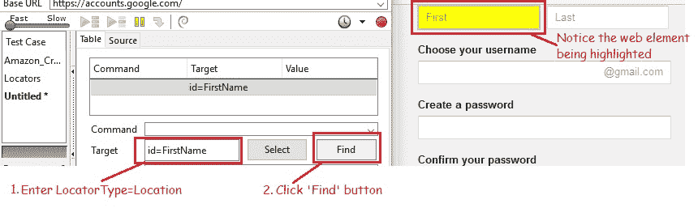
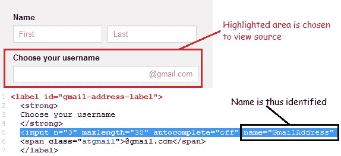
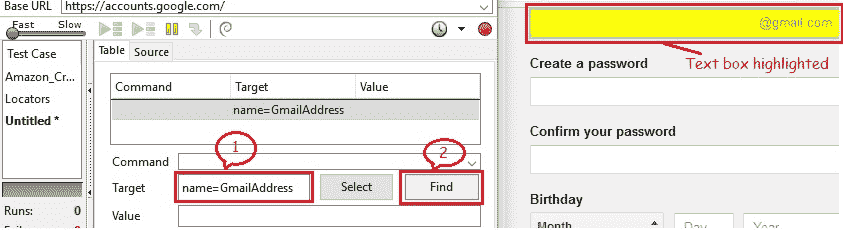
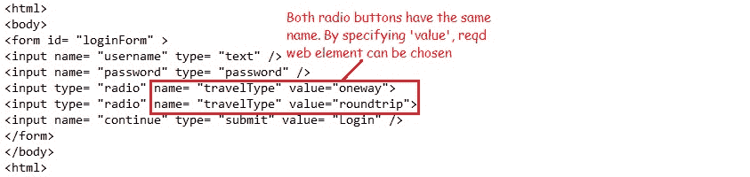
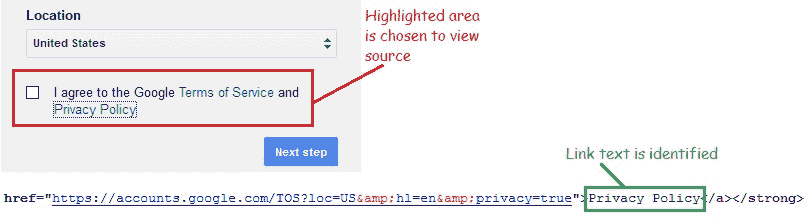
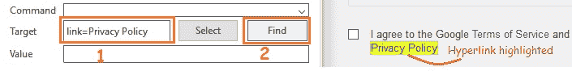

# 7K Selenium IDE – 定位元素（按 ID，名称，链接文本）

> 原文： [https://javabeginnerstutorial.com/selenium/7k-ide-locating-elements/](https://javabeginnerstutorial.com/selenium/7k-ide-locating-elements/)

大家好！ 这篇文章是关于在网页上定位元素的（正如上一篇文章中所承诺的）。

如今，确定一个人的地理位置变得非常容易。 GPS 使这成为可能。 同样，可以使用**定位符类型**来确定 Selenium IDE 必须对其进行操作的确切 Web 元素（例如，文本框，复选框，按钮，链接，下拉列表等）。

如果您注意到由 Selenium IDE 生成的自动测试脚本，则可以看出大多数命令都需要目标。 该目标标识正在测试的 Web 元素，其格式为`LocatorType = Location`。 `LocatorType`在大多数情况下可以省略，我们很快就会看到。

到现在，您应该已经意识到，对于创建成功的测试脚本而言，准确地识别网页上的 Web 元素至关重要。 记住我的话，说起来容易做起来难！ 有时，我们最终会遇到错误的元素或最坏的情况，根本没有任何元素。

当我们在*魔法草地*中时，为什么还要担心？ Selenium IDE 提供了许多定位器类型，可以在网页上准确定位 Web 元素。

定位依据

*   ID
*   名称
*   链接文本
*   CSS
*   DOM
*   XPath

## 通过 ID 定位

知道网络元素的 ID 属性后，我们总是倾向于按 ID 进行定位。 由于 ID 是唯一的，因此这是定位被测元素的最常用方法。

*格式*：`id = web_element_id`

*示例*：打开 Goog​​le 帐户创建页面。 让我们通过 ID 识别名字文本框。

    

借助 HTML（页面源代码）或 Firebug（我们将在以后的文章中详细介绍），可以识别 ID，如上图所示。

在 Firefox 浏览器中打开 Selenium IDE，然后在目标文本框中输入“`id = FirstName`”。 单击**查找**按钮，并注意“名称”部分的“第一个”文本框以黄色突出显示，带有绿色边框。 这表明 Selenium IDE 能够成功地按预期找到元素。

## 按名称定位

名称定位器类型使用匹配的名称属性来定位第一个 Web 元素。 这与按 ID 定位非常相似，而 ID 由名称代替。

*格式*：`name = web_ element_name`

*示例*：打开 Goog​​le 帐户创建页面。 让我们通过使用页面来源的名称来标识“选择您的用户名”文本框。

使用 Selenium IDE“查找”元素以验证我们是否准确定位了该元素。

如果多个 Web 元素具有相同的`name`属性，则使用**过滤器**进一步细化定位策略。 默认过滤器类型为*值*。

*示例*：

如上所述，如果使用“`name = travelType`”定位策略，则将在网页上选择一个单选按钮，因为它是具有给定`name`属性的第一个 Web 元素。 但是，如果我们希望根据测试用例要求使用往返单选按钮，则将使用*按名称和过滤器*策略定位。

在 Selenium IDE 的“目标”框中输入“`name = travelType value = roundtrip`”，然后单击“查找”按钮，将高亮显示往返单选按钮。

## 通过链接文本定位

在网页上找到超链接的最佳方法是使用“链接文本”策略进行定位。

*格式*：`link = text_of_the_link`

*示例*：打开 Goog​​le 帐户创建页面。 让我们使用网页来源通过链接文字访问“隐私权政策”链接。

使用 Selenium IDE “查找”元素以验证我们是否准确定位了该元素。

我认为一天就足够了。 其余的将在后续文章中讨论。 练习这些策略，并在评论部分有任何疑问时通知我。

到那时见！ 祝你有美好的一天！

