# 7L Selenium IDE – 定位元素（续）

> 原文： [https://javabeginnerstutorial.com/selenium/7l-ide-locating-elements-contd/](https://javabeginnerstutorial.com/selenium/7l-ide-locating-elements-contd/)

嗨呀测试人员！ 我回来了，比赛开始了！ 让我们继续前进，在我们的网页上找到一些古怪的元素！！

在这篇文章中，我们将看到：

定位依据

*   CSS
*   DOM
*   XPath

让我们一一看一下。

## 通过 CSS 定位

CSS（层叠样式表）将样式添加到网页中，通常用于描述 HTML 文档的显示或呈现。 为了将这些样式属性绑定到文档中的元素，使用了 **CSS 选择器**。 这些选择器用于根据其名称，ID，类，属性等的组合来选择 HTML 元素。

通常，高级 Selenium 用户会通过这种方法在网页上定位元素。 它有点复杂，但主要在元素没有 ID 或名称的情况下首选。

指定目标的格式以标签“`css =`”开头，后跟相应的标签名称和其他必需元素。 让我们欣赏使用最常用的 CSS 选择器定位元素的巨大优势。

### 标签和 ID

HTML 标记和元素的 ID 与井号（`#`）一起使用。

*格式*： `css = tag#id`

*示例*：打开 Amazon 的登录页面。 让我们找到“电子邮件（用于移动帐户的电话）”文本框。

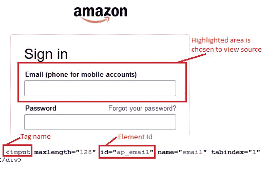

标记名称为“输入”，元素的 ID 为“`ap_email`”。

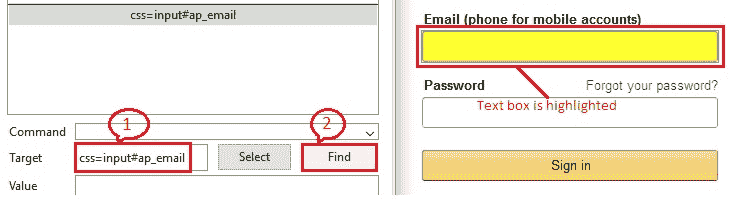

因此，按照目标格式，输入“`css = input#ap_email`”并单击“查找”按钮将按预期突出显示网页上的“电子邮件”文本框。

### 标签和类别

此方法使用 HTML 标记和要访问的元素的类以及点（`.`）符号。

*格式*：`css = tag.class`

*示例*：打开 Indeed.com，让我们突出显示文本“`what`”。

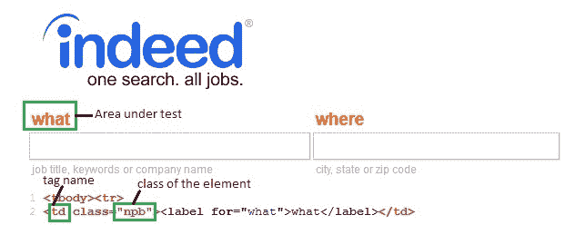

标签名称为“`td`”，元素的类别为“`npb`”。

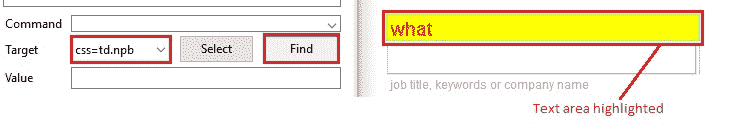

输入“`css = td.npb`”，然后单击“查找”按钮，将突出显示文本“`what`”。 如果多个元素具有相同的标记和类名称，则仅会识别与条件匹配的第一个元素。 在这种情况下必须使用过滤器。 在之前的博客文章中对此概念进行了详细说明。

### 标签和属性

在此方法中使用 HTML 标记，最好使用要访问的元素的唯一属性及其对应的值。 属性和值用方括号[]括起来。

*格式*： `css = tag[prop=value]`

*示例*：打开亚马逊登录页面，让我们找到“电子邮件”文本框。

标签名称为“`input`”，属性为“`name`”，其对应值为“`email`”。

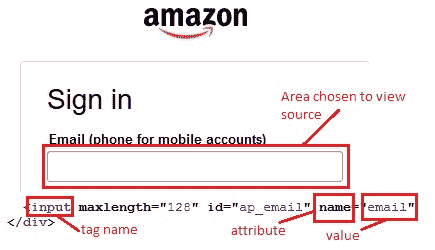

为目标输入“`css = input[name=email]`”，然后单击“查找”按钮，将突出显示“电子邮件”文本框。

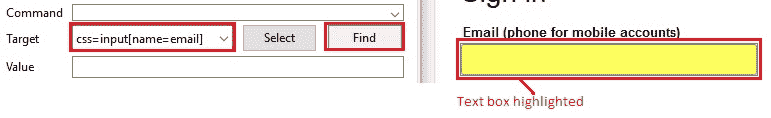

### 标签，类和属性

这与“标记和属性”定位策略相似，但是带有类名和点（`.`）符号。 通常在两个 Web 元素具有相同的标记和类名称时使用。

*格式*： `css = tag.class[prop=value]`

*示例*：打开 facebook.com，让我们找到“电子邮件或电话”文本框。

请注意下图，“电子邮件”和“密码”文本框具有相同的标签“`input`”和相同的类名“`inputtext`”，但属性“`tabindex`”的值不同。

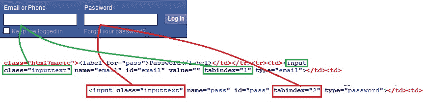

因此，标签名称为“`input`”，类为“`inputtext`”，属性为“`tabindex`”且其对应值为“1”的标签将突出显示“电子邮件或电话”文本框。 属性值与“2”相同的组合将突出显示“密码”文本框。

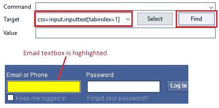

输入“`css = input.inputtext[tabindex=1]`”以突出显示“电子邮件或电话”文本框。

### 内部文本

在某些情况下，ID，类或属性未用于特定元素。 要找到这样的元素，可以使用网页上显示的实际文本（内部文本）。

*格式*： `css = tag:contains("innerText")`

*示例*：打开亚马逊登录页面，让我们突出显示文本“`Password`”。

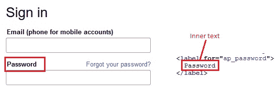

这里的标签是“`label`”，内部文本是“`Password`”。 输入“`css = lable:contains("Password")`”高亮显示文本“`Password`”。

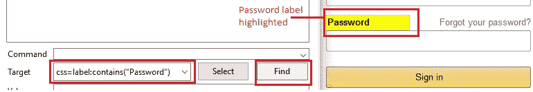

## 通过 DOM 定位

文档对象模型是用于表示 HTML 文档中元素的约定。 定位策略利用了 DOM 模型中使用的树结构。 因此，使用分层的点分符号来获取元素的位置。

指定 DOM 定位器时，不需要“`dom =`”标签，因为只有 DOM 定位器以单词“`document`”开头。

*示例*代码：

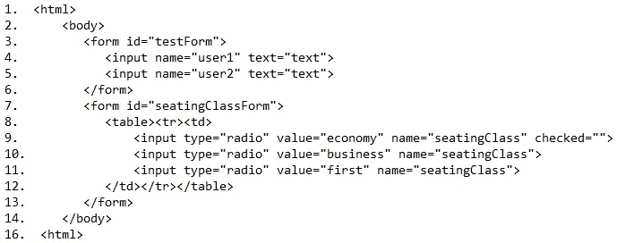

*方法 1*：`document.getElementById("testForm")`– 使用元素的 ID。

*方法 2*：`document.forms[0]` – “表单”将返回文档中使用的所有表单的集合。 因此，使用索引以唯一的方式指定被测元素。

*方法 3*：`document.forms[0].user1` – 第一种形式，访问`user1`元素。

*方法 4*：`document.getElementsByName("seatingClass")[1]` – “`getElementsByName`”也将返回括号内指定名称相同的元素集合。 因此，索引返回所需的元素。 在这种情况下，可以访问业务单选按钮。 如果使用索引`[0]`，则可以访问经济单选按钮。

*方法 5*：访问`document.forms["testForm"].elements["user2"]` – 名为“`testForm`”的表单的`user2`。

*方法 6*：`document.forms[1].elements[2]` – 这将返回“`seatingClassForm`”中的“第一个”单选按钮。

现在是时候使用 Selenium IDE 探索 Web 应用的 DOM 了。

## 通过 XPath 定位

XPath 是一种语法，用于在 XML 文档中导航和定位节点。 由于 HTML 只是 XML 的实现，因此可以使用 XPath 策略来查找所需的元素。

如果找不到合适的 ID，名称或类等来查找元素，则可以使用 XPath。 使用 XPath 定位元素有两种。 一个是绝对路径（不建议使用），因为它会在对现有 HTML 代码进行最小改动的情况下中断。 另一个选项是相对路径 – 使用 ID 或名称查找附近的元素，并使用两者之间的关系使用 XPath 查找所需的元素。 因此，几乎可以使用 XPath 策略定位网页上的任何元素。

这种定位策略非常复杂，通常是高级 Selenium 用户首选的定位策略。 但是不用担心！ 为了使整个 XPath 查找方法变得容易，我们将“Firebug”作为 Firefox 浏览器的附加组件。 很快您就会遇到一篇博客文章，该文章完全致力于 Firebug 的安装和使用！ 欢呼！！

另外，由于仅 XPath 定位符以“`//`”开头，因此不需要为 XPath 定位符指定“`xpath =`”。

*示例*：打开 Amazon 登录页面，然后让我们使用 XPath 找到“电子邮件”文本框。

点击 Firebug 图标并检查所需的元素（在本例中为“电子邮件”文本框）。 相应的源代码将显示在网页的下部。

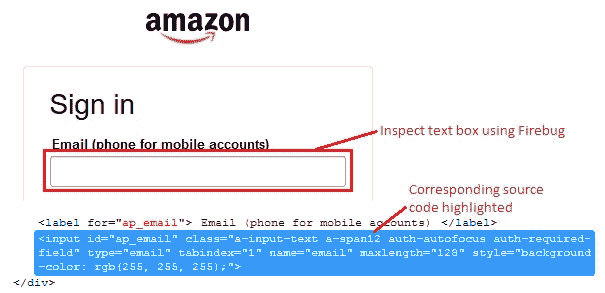

右键点击突出显示的代码，然后选择“复制 XPath”，如下所示。

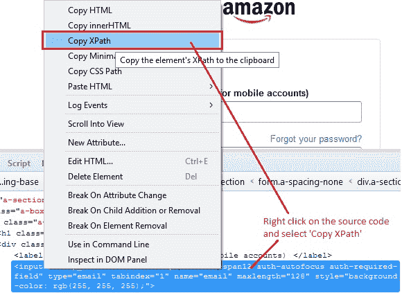

在目标中，输入一个正斜杠（`/`），然后使用 Firebug 粘贴复制的 XPath，“`//html/body/div[1]/div[1]/div[3]/div/div[2]/form/div/div/div/div[1]/input`”。 请注意，XPath 定位符应以两个正斜杠开头。

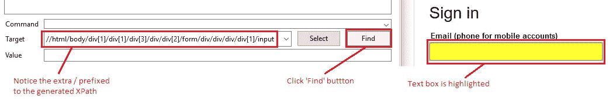

因此，“电子邮件”文本框将按预期突出显示。

你去！ 我们刚刚完成了各种可用的定位策略。 是的，要选择的定位器类型完全取决于要测试的应用。

在将如此多的知识融入您的大脑之后，我知道您将每年两次要求我六个月的假期。 因此，在另一篇文章中再见。

祝你今天愉快！

