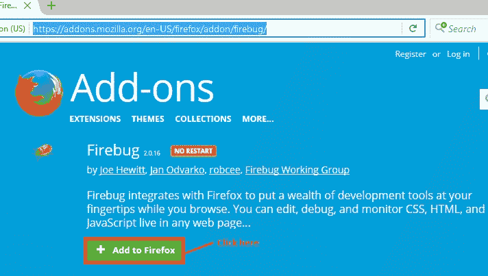
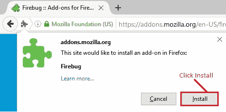
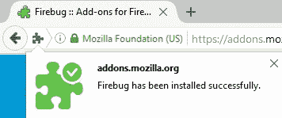
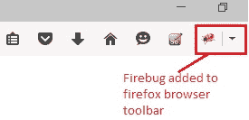
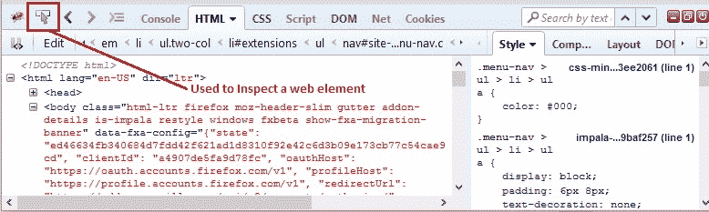

# 7N Selenium IDE – 利用 Firebug 的优势

> 原文： [https://javabeginnerstutorial.com/selenium/7n-ide-using-firebug/](https://javabeginnerstutorial.com/selenium/7n-ide-using-firebug/)

嗨呀测试人员！ 欢迎来到另一篇探索文章。

最近，我们讨论了如何使用 XPath 在网页上定位元素。 您可以使用页面的源代码，并提供一个非凡的 XPath，但是它可能无法正常工作。 我知道这并不是很能激发人们的兴趣，但是 XPath 策略非常复杂，高级 Selenium 测试人员经常使用它。 来吧，沉思它没有意义。

曾经有人说我的奴才，*如果计划 A 失败，请记住您还有 25 个字母！* 因此，不要放弃！ 我们强大，无敌，无与伦比的测试人员今天将使用 **Firebug** 来发挥我们的优势。

Firebug 是 Mozilla Firefox 浏览器的附加组件。

## 安装步骤：

打开 Firefox 浏览器。 转到 [https://addons.mozilla.org/en-US/firefox/addon/firebug/](https://addons.mozilla.org/en-US/firefox/addon/firebug/) 并单击“添加到 Firefox”按钮。

点击“安装”开始安装。

安装完成后，将显示如下通知。

    

Firebug 图标也会自动添加到浏览器的工具栏中。

单击工具栏上的图标或按 F12 键将显示 Firebug 的 UI，这使我们可以无限制地监视任何网页中实时存在的 CSS，HTML 和 JavaScript 以及其他功能，例如检视元素等。

检查所需元素将显示相应的源代码。 右键单击同一文件夹，将显示“复制 XPath”的选项。 它是如此简单！

现在，我建议您通过单击这里的[来看看如何通过 XPath 策略定位元素。](https://javabeginnerstutorial.com/selenium/7l-ide-locating-elements-contd/)

在另一篇文章中再见。 祝你有美好的一天！

