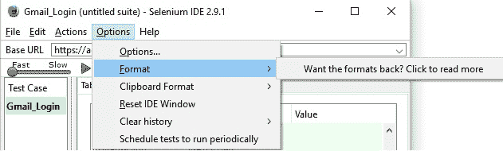
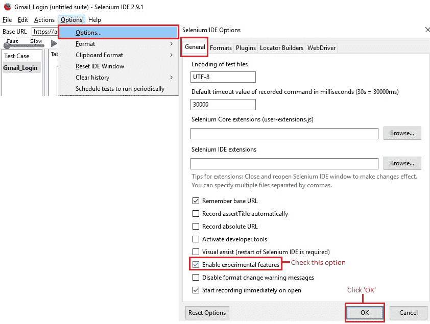
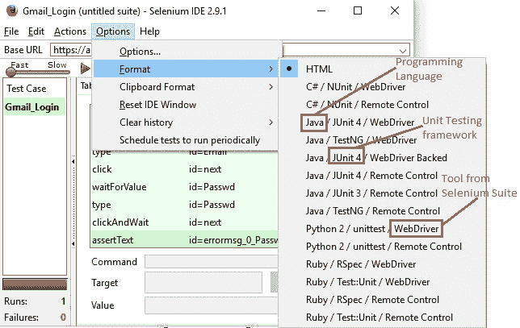
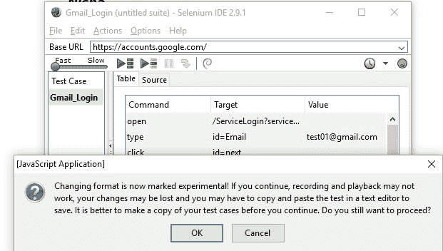
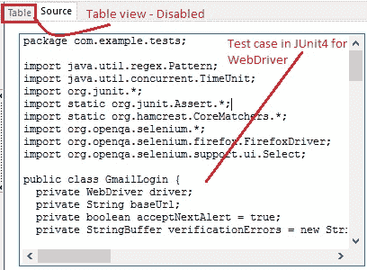
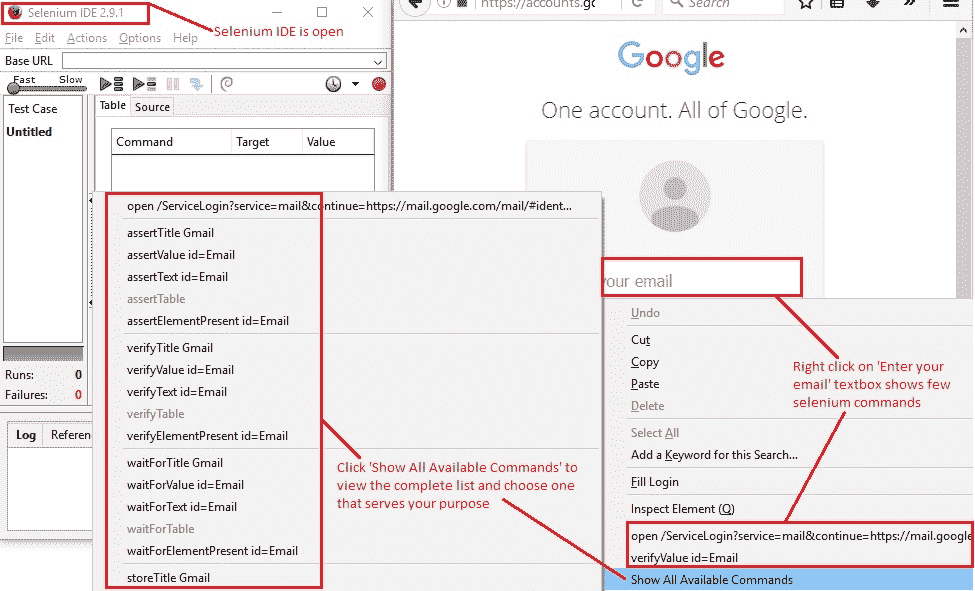

# 7P Selenium IDE – 其他功能

> 原文： [https://javabeginnerstutorial.com/selenium/7p-ide-features/](https://javabeginnerstutorial.com/selenium/7p-ide-features/)

在魔幻草原之地，您身边有很多功能，这使我们的生活更加轻松！ 我同意，我们已经介绍了很多功能，但是在此我想重点介绍这两个特殊功能。

## 启用实验功能

在我们的[上一篇文章](https://javabeginnerstutorial.com/selenium/7o-ide-export-testcase/)中，我们看到了如何将测试用例导出到所需的编程语言，否则默认情况下将其记录为 HTML。 想象一下，您不仅希望导出，还希望在测试脚本窗格的“源”选项卡中以所需的所选语言查看确切的代码。 无论出于什么原因，您可能都希望进行一些探索和试验。

别担心，您的愿望就是我的命令。 让我向您展示我们现在和现在如何实现这一目标。 好吧，我们该怎么做？ 简单。 通过选中一个复选框（*我知道这听起来很机灵…*），吹嘘自己为“启用实验性功能”！

让我们进入细节。 通常，在单击选项->格式后，您可能会看到一条消息“是否要返回格式？ 点击阅读更多”，如下所示，

因此，在不显示格式的情况下，我们将如何查看所选语言的代码？

因此，单击“选项->选项...”，然后会打开“Selenium IDE 选项”窗口。 在“常规”标签中，选中“启用实验性功能”复选框。 点击“确定”按钮。 而已！

现在，“格式”选项显示了 Selenium IDE 测试用例可以转换成的可用格式。 HTML 是默认选择的格式。 该格式提供了将所选测试用例转换为的编程语言/单元测试框架/套件中可与代码一起使用的工具的组合。

    

选择所需的格式组合（在这种情况下为“Java/Junit4/WebDriver”）后，将出现警报。

> **注意**：
> 
> 如上图所示，此功能被标记为实验性，并且这样做是有原因的。 始终建议使用“文件”菜单中的“导出测试用例为”功能将测试用例转换为另一种语言。 通常会警告您，除非您确实*确实想要*，否则请不要使用“格式”菜单项。
> 
> 想知道为什么所有这些复杂的功能看起来如此简单？ 让我们看看……Selenium IDE 只能与基于 HTML 的 Selenese 一起使用。 因此，启用此功能后，它会以所选语言显示代码，就像以该语言进行录制一样。 但不是！ 真正发生的是，在后台，它维护了测试用例的副本，并在进行中转换为所选的语言，并向您显示。 可悲的是，这种“格式”功能并不十分稳定。 保存测试用例并尝试重新打开后，它可能会或可能不会发生。 多数情况下可以，但是我注意到播放选项被禁用。 另外，不仅很难进行更改，而且当再次更改格式时所做的更改也会丢失。 现在是您的电话！

无论如何，如果您决定继续尝试一下，请继续并在警报框中单击“确定”，然后注意“表”视图窗格已禁用。

但是 Voila！ 现在，“源”视图窗格将以选定的格式显示测试用例！！

## 生成命令的简单方法

Selenium 涉及的一项主要活动是使用不同的定位器来识别 Web 元素。 Selenium IDE 会自动为您执行此操作。 但是在某些情况下，您可能想插入新的命令（以及通过记录活动获得的自动生成的代码）来进行断言，验证等。在这种情况下，请不要使用检查元素功能来定位 Web 元素，然后努力使用正确的命令语法，我们有了一个捷径。 **右键单击！** 你没听错。

右键单击您要在其上执行操作的网页元素（显然是在 Firefox 浏览器中！），将自动打开一个菜单，提示与所选元素配合使用的大多数可能的 Selenium 命令。 要获取整个列表，只需单击“显示可用命令”选项。

这里唯一的问题是：应该打开 Selenium IDE。 不需要打开“记录”模式。 只需打开 IDE 窗口就足够了。

希望对您有所帮助！ 因此，在另一篇文章中再见。

祝你有美好的一天！

