# 7Q Selenium IDE – 快速浏览插件

> 原文： [https://javabeginnerstutorial.com/selenium/7q-ide-plugins/](https://javabeginnerstutorial.com/selenium/7q-ide-plugins/)

当心，您将很快进入 Selenium IDE 系列的最后一篇文章。 因此，有时间规划一下未来的美好生活！ 让我们快速看一下几个可用的插件！

官方网站上有许多插件，您可以从页面上它们的相应部分下载，网址为 <http://docs.seleniumhq.org/download/>。

## 失败的屏幕截图

当测试步骤失败时，抓取屏幕截图非常重要，以便可以相应地报告它。 在 Selenium WebDriver 中，通过编程语言实现非常简单。 开发此插件是为了在 Selenium IDE 中获得相同的结果。 一旦安装并打开它，在测试失败时，将捕获整个网页。 最好的部分是，您可以选择指定一个自定义位置，以将这些屏幕截图保存在相应的项目文件夹下，以备将来参考或轻松识别。

让我们首先查看下载和安装过程。

在“Selenium IDE 插件”下，单击“ScreenShot on Fail”的下载链接。

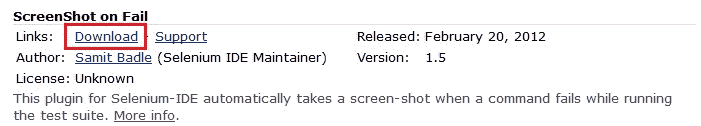

您将被重定向到 Firefox 的“加载项”页面，您可以在其中找到屏幕截图和插件说明以及“添加到 Firefox”按钮。

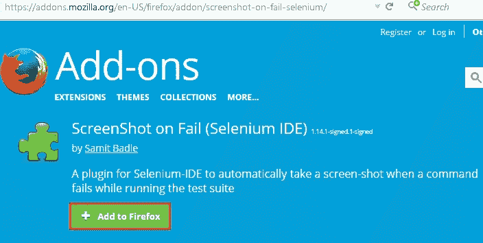

点击“添加到 Firefox”按钮将提示如下，

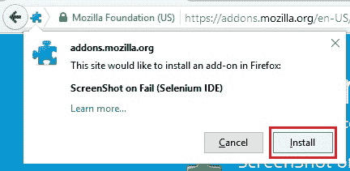    

点击“安装”和“立即重启”按钮。

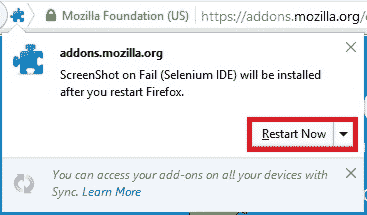

现在，该插件将自动添加到 Selenium IDE 中，并显示在工具栏上。

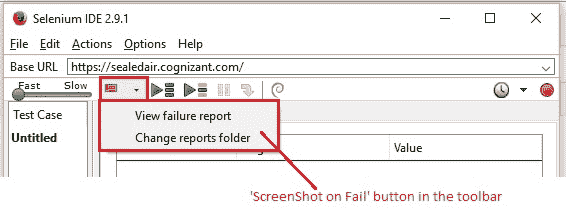

单击下拉箭头将显示选项，以查看故障屏幕截图并自定义报告的保存位置。

让我们先这样做！ 要自定义将故障报告存储在我们系统上的目标文件夹的位置，请单击“更改报告文件夹”，然后根据需要浏览路径。 点击“选择文件夹”以确认选择。

让我们看一个示例，以了解其工作原理！

1.  打开“<https://www.google.com/>”
2.  将页面标题声明为“Google”
3.  验证是否存在“Google 搜索”按钮
4.  验证超级链接是否包含“Gmail”
5.  点击“Gmail”链接，然后等待页面加载
6.  尝试验证页面上不可用的内容，以使测试用例失败。

为了继续进行操作，请确保通过单击工具栏中显示的“屏幕截图失败”按钮一次来打开插件。 播放测试用例，由于找不到特定的 Web 元素，因此在最后一步将失败。

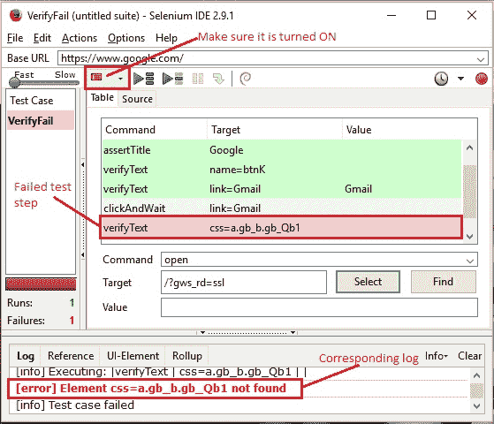

测试用例执行完成后，再次单击插件按钮将其关闭。 要查看故障报告，有两种方法：

1.  从插件按钮下拉菜单中单击“查看失败报告”，以在当前打开的 Firefox 浏览器的新标签中打开报告。

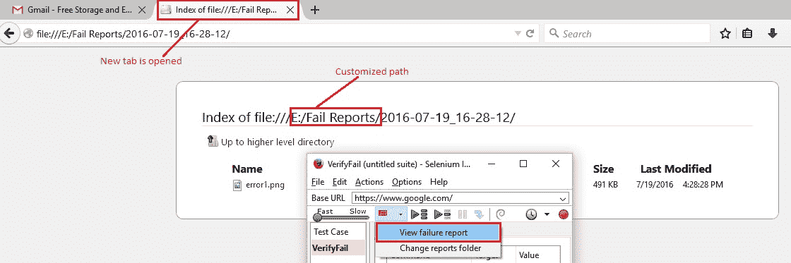

2.  或导航到系统中的自定义路径。 将创建一个名为时间戳的新文件夹，并将错误屏幕截图保存在其中。 当要执行涵盖不同项目的大量测试用例时，此功能非常有用。 错误屏幕截图可以保存在其相应的项目路径中以供参考。

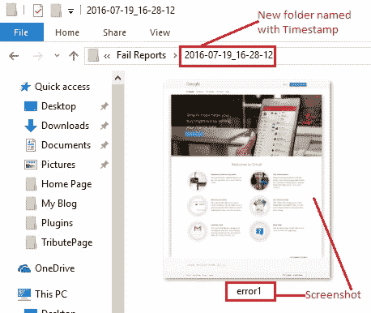

## 文件记录

与“ScreenShot on Fail”类似，此插件也可以从官方网站的“Selenium IDE 插件”部分的下载页面下载。

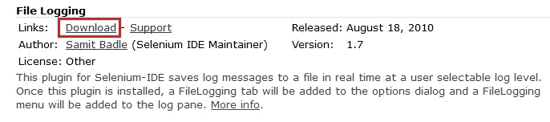

单击下载链接后，您将重定向到“加载项”页面。 点击“添加到 Firefox”按钮。 安装并重新启动浏览器。

打开 Selenium IDE 窗口后，在“日志/参考”窗格中，将看到一个新的“文件记录”选项卡，该选项卡默认情况下处于关闭状态。 单击下拉列表，选择“日志文件路径”和“日志级别”。

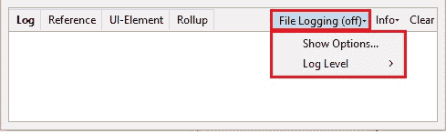

这些设置可以通过两种方式执行：

1.  点击“文件记录”标签下拉菜单，然后点击“显示选项...”
2.  或菜单栏中的“选项”->“选项...”，然后单击“文件记录”标签。

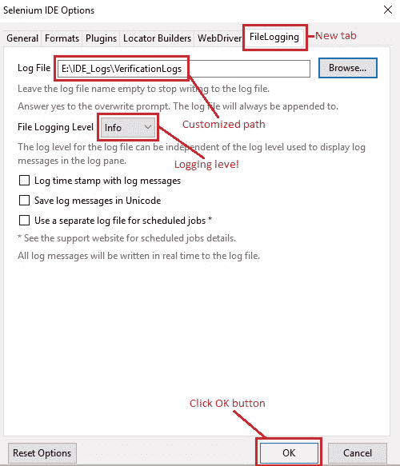

点击“浏览”按钮，浏览至所需路径并提供文件名。 如果使用相同的日志文件路径和名称执行多个测试用例，则将附加日志。 如果出现提示覆盖日志的提示，只需单击“是”。 这是插件中的问题，但无需担心。 另外，如果您希望停止记录，则将文件名保留为空白。

从“文件记录级别”下拉菜单中选择级别-调试，信息，警告或错误。 此日志记录级别与从“日志/参考”窗格中选择显示的日志级别无关。

根据需要单击相应的复选框，以将时间戳记和消息一起记录，将它们保存为 Unicode 并为计划的作业使用单独的日志文件。

点击“确定”按钮以保存所做的更改。

让我们执行相同的示例，并检查所选位置的日志文件。 如下面的屏幕快照所示，我为显示日志选择了“错误”级别，为文件记录选择了“信息”级别。

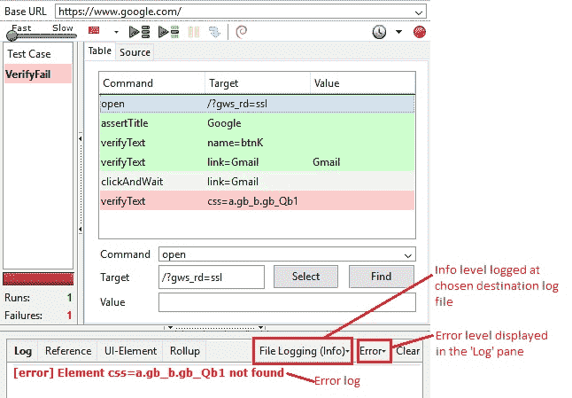

信息级别日志将以所选路径写入文件。

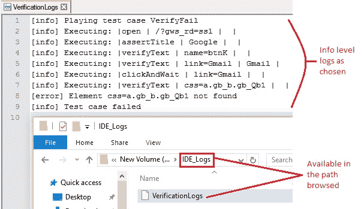

希望这两个插件能为您提供总体上如何根据需要和便利来下载，安装和使用 Selenium IDE 插件的总体情况。 这些特殊功能在您遇到困难时确实可以派上用场！ 因此，如果您有任何疑问，请务必在评论部分中发掘并留言。

在另一篇文章中再见。 祝你有美好的一天！

